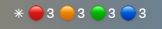

# claudebar

A [SwiftBar](https://swiftbar.app) plugin that puts the state of every Claude
Code session in your macOS menu bar, including sessions running inside Docker
sandboxes (`sbx`). Bash and `jq`, nothing else.



At rest it is one status item: `✳` plus a count per state — permission,
waiting, ready, working. Zero counts are hidden.


Open it and each session is a row: state, repo `@` branch, how long it has sat
there, and a subtitle saying what the session is about. The subtitle is the
session's `/resume` title, or your last prompt (`❯`) until Claude Code has
written one. Sandbox rows lead with 📦 and the box name. Red rows spell out the
command waiting for your approval.

Clicking a row focuses that session's IntelliJ project window; ⌥-click
dismisses a stale entry. Set `MENU_SHORTCUT` and a global hotkey opens the
board, where ↑/↓ walk the rows and Return focuses one. Rows sort
longest-waiting first.

Sounds are off by default — the 🔕/🔔 row at the bottom of the dropdown turns
them on. To see the board without running any sessions, run
[`examples/demo-board.sh`](examples/demo-board.sh).

## Install

```bash
npx github:triffer/claudebar install
```

That installs `jq` and SwiftBar via Homebrew if they are missing, points
SwiftBar at a plugin folder, copies the hook and plugin scripts into
`~/.claude/`, registers the hooks in `~/.claude/settings.json`, and loads a
launchd agent that picks up events from sandboxes. Pass `--no-deps` to skip the
Homebrew step. Restart running Claude sessions afterwards so the hooks load.

Pin a version if you want one:

```bash
npx github:triffer/claudebar#v1.0.0 install       # exact release
npx "github:triffer/claudebar#semver:^1" install  # latest 1.x
```

From a clone it is `./install.sh`, with the same effect. Either way the
installer is idempotent, so re-run it after pulling. Uninstall with `npx
github:triffer/claudebar uninstall` or `./install.sh --uninstall`.

The bottom row of the dropdown shows the version you are running. Once a day
the board asks GitHub for the newest release; when there is one, that row turns
orange and links to the release notes, and the row under it copies the update
command to your clipboard. claudebar never updates itself. That daily `curl` is
the only network traffic, and `UPDATE_CHECK_HOURS=0` stops it.

## Sandboxes

Mount the signal bridge when creating the sandbox and add the bundled kit,
which symlinks `~/.claude/hooks/` into the box and merges the hook
registrations into its settings:

```bash
sbx create claude . \
  ~/.claude:ro \
  ~/.claude-signals \
  --kit <this-repo>/claudebar/sbx-kit
```

The sandbox needs `jq` (the default Claude sbx image has it) and those two
mounts. If you already use a kit that links hooks and merges settings, you
don't need `sbx-kit` on top.

sbx mounts keep their host path inside the microVM, so the bridge shows up at
`/Users/<you>/.claude-signals`. It has to be a sibling of `~/.claude`, not a
subdirectory, because the `~/.claude` mount is read-only.

Inside the sandbox the hook finds the bridge via the `/Users/*/.claude-signals`
glob and drops status records there; the watcher on your Mac applies them
within a couple of seconds. `CLAUDE_SIGNALS_DIR` overrides the probe, and
setting it to the empty string forces local delivery (that's how the test suite
runs the hook on Linux CI).

In `--clone` boxes the hook derives the repo name from the clone's `origin`
remote, so the row still reads `📦 mybox · repo @ branch` after the agent
switches branches. Clicking it focuses the repo's IDE window on the host, which
shows the host's state of the repo — the box's commits appear only after
`git fetch sandbox-<name>`.

## Configuration

`~/.claude/notify.conf` is plain bash, sourced by the plugin.

| Variable             | Default             | Meaning                                            |
|----------------------|---------------------|----------------------------------------------------|
| `IDE_CMD`            | auto-detected       | JetBrains CLI launcher used to focus a project (`idea`, `goland`, `pycharm`, …) |
| `TERMINAL_BUNDLE_ID` | auto-detected       | App focused instead when `IDE_CMD` is empty        |
| `STALE_HOURS`        | `1`                 | Hide sessions idle longer than this                |
| `BAR_STYLE`          | `detailed`          | `detailed` = per-state counts; `minimal` = a single ✳ that lights up only when a session needs you |
| `BAR_SHOW_WORKING`   | `1`                 | Show the 🔵 working count in the detailed bar      |
| `MENU_SHORTCUT`      | `CTRL+OPTION+CMD+C` | Global hotkey that opens the board; empty = none   |
| `UPDATE_CHECK_HOURS` | `24`                | How often to check GitHub for a release; `0` = never |

Each session records its git toplevel, and `idea <root>` focuses an already
open project window (opening it otherwise). sbx keeps working trees at their
host path, so the recorded root is valid on the Mac for sandbox sessions too.

`MENU_SHORTCUT` accepts any combination of `CMD`, `OPTION`, `CTRL`, `SHIFT` and
`FN`. The default has three modifiers on purpose: a global hotkey outranks the
frontmost app's own, so a collision silently breaks that shortcut everywhere
with nothing pointing the blame back here. That rules out `⌘Space`/`⌥Space`
(Spotlight, Raycast, Alfred), `⌃⌘Space` (emoji), `⌘⇧3/4/5` (screenshots) and
plain `⌘⌥<letter>`, where JetBrains keeps its refactorings.

## Troubleshooting

- Board never changes: check the hooks are registered with
  `jq .hooks ~/.claude/settings.json`, and restart sessions started before the
  install.
- Sandbox sessions missing: check the watcher with
  `launchctl list | grep com.claude.notify` and read
  `~/.claude/watcher.error.log`. Inside the sandbox,
  `ls -d /Users/*/.claude-signals` must exist and be writable.
- Malformed events land in `~/.claude/signals-rejected/` instead of looping.
- Stale rows: crashed sessions never send `SessionEnd`. They fade after
  `STALE_HOURS`, are deleted after two days, or you can use Dismiss / Clear all.

## How it works

```
   host session                     sandbox session
        │                                 │
        ▼ hooks                           ▼ hooks
  claude-notify.sh                  claude-notify.sh
        │                                 │ writes evt_*.json
        │                                 ▼
        │                  /Users/<you>/.claude-signals (rw mount of ~/.claude-signals)
        │                                                              │
        │                                          launchd (QueueDirectories)
        │                                                              │
        │                                              claude-signal-watcher.sh
        │                                                              │
        └───────────► claudebar-lib/record.sh (the store) ◄────────────┘
                                      │
                                      ▼
                         ~/.claude/notifier-sessions/*.json
                                      │
                                      ▼
                    SwiftBar plugin (claudebar.3s.sh)
```

| File                                | Responsibility |
|-------------------------------------|----------------|
| `hooks/claudebar-lib/paths.sh`      | Where things live: the store, the config, both ends of the signal bridge |
| `hooks/claudebar-lib/record.sh`     | The status record: its field list, building it, reading it back, storing it, relaying it |
| `hooks/claudebar-lib/transcript.sh` | Lifting a session's `/resume` title out of the transcript |
| `hooks/claudebar-lib/version.sh`    | Installed version, release comparison, and the cache that keeps the check off the network |
| `hooks/claude-notify.sh`            | The hook: hook event → state → record |
| `host/claudebar.3s.sh`              | The SwiftBar plugin: records → menu bar |
| `host/claude-signal-watcher.sh`     | Applies records a sandbox left on the bridge |
| `host/claudebar-focus.sh`           | The click action behind a session row |
| `host/claudebar-update.sh`          | The version row: `--check` asks GitHub, `--copy` puts the update command on the clipboard |

The library sits inside `hooks/` because `sbx-kit/spec.yaml` symlinks exactly
that directory into a sandbox — a sibling directory would resolve on the host
and be missing in the microVM. `~/.claude/hooks/` is shared space, so the
directory is named `claudebar-lib/` rather than `lib/`, and install drops a
`.claudebar` marker inside it that both install and uninstall check before
removing anything.

The record is the contract between the hook that writes it and the plugin that
renders it. Both ends are generated from the one field list in `record.sh`, so
they can't drift apart.

One hook script handles six events and tracks a state per session:

| Event                                            | State           |
|--------------------------------------------------|-----------------|
| `UserPromptSubmit`, `PreToolUse`                 | 🔵 `working`    |
| `Notification` (permission)                      | 🔴 `permission` |
| `Notification` (idle / other)                    | 🟠 `waiting`    |
| `SessionStart` (new/resumed), `Stop`             | 🟢 `ready`      |
| `SessionEnd`                                     | removed         |

`SessionStart` from auto-compaction is ignored: it fires mid-task and must not
flip a busy session. `PreToolUse` fires before the permission prompt resolves,
so it also captures the pending tool and input into a per-session context file.
That's how a red row can say what Claude wants to run.

### Session titles

Claude Code drops title records into the transcript JSONL — the strings its
`/resume` picker lists. The hook picks the newest one and parks it in the
context file, where it becomes the row's subtitle. Two spellings are accepted,
since the record changed shape: `{"type": "ai-title", "aiTitle": …}` in 2.1.x,
`{"type": "summary", "summary": …}` before that.

The transcript format is Claude Code internal and gets no compatibility
promise, so the scan is defensive. It reads a 200-line head and a 500-line tail
and nothing else, which keeps a 100 MB transcript at roughly 30 ms. It runs on
every `SessionStart`, and on `UserPromptSubmit`/`Stop` while the session has no
title, then backs off to once every 10 minutes
(`CLAUDE_NOTIFY_SUMMARY_TTL=<seconds>` to change that). Malformed or reshaped
records are dropped rather than raised: a scan that finds nothing leaves the
previous title in place, and a format change means rows fall back to your last
prompt instead of the hook breaking your session. The plugin never opens a
transcript at all.

## Contributing

```bash
npm install
npm test
npx bats test/board-render.bats   # one file
```

The suite runs the real scripts — hook, watcher, plugin and `install.sh` —
against a throwaway `HOME` with `launchctl`, `curl`, `uname` and the other
host-touching commands stubbed, so nothing reaches your own sessions or
`~/.claude`. See `CLAUDE.md` for the conventions.

Commit messages must follow
[Conventional Commits](https://www.conventionalcommits.org/); `commitlint` runs
on every PR.

| Prefix                            | Release        |
|-----------------------------------|----------------|
| `fix: …`                          | patch (`x.y.Z`)|
| `feat: …`                         | minor (`x.Y.0`)|
| `feat!: …` / `BREAKING CHANGE:`   | major (`X.0.0`)|
| `chore:`, `docs:`, `refactor:`, … | no release     |

[semantic-release](https://semantic-release.gitbook.io/) handles the rest on
merge to `main`: version, tag, `CHANGELOG.md`, GitHub Release. There is no npm
publish — the git tag is the release artifact, which is what `#semver:` ranges
resolve against. Don't bump `package.json` by hand.
