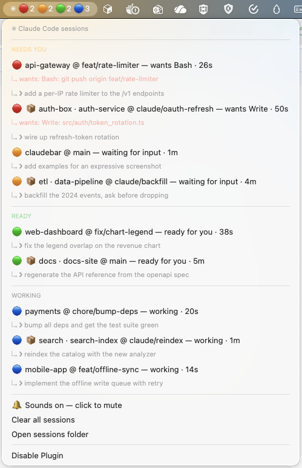

# claudebar

A [SwiftBar](https://swiftbar.app) plugin that puts the live state of every
Claude Code session in your menu bar — whether it runs on your Mac or inside
a Docker sandbox (`sbx`).

Running several Claude sessions in parallel means losing track of which one
needs you. This board fixes that — no popups, no context switching: the menu
bar is the whole interface.



*Nine sessions across host and sandbox, grouped by state — the menu bar itself
reads `✳ 🔴2 🟠2 🟢2 🔵3`. Reproduce this board for a screenshot with
[`examples/demo-board.sh`](assets/demo-board.sh).*

## Features

- 🚦 **Per-state counts in the menu bar** — `✳ 🔴1 🟠2 🔵3` = one permission
  prompt, two sessions waiting, three working (zero counts hidden). A dim `✳`
  when nothing is running; the leading `✳` marks the item as the Claude board
  among your other menu bar apps, and the dropdown opens with a "✳ Claude
  Code sessions" header. Prefer quieter? `BAR_STYLE="minimal"` shows a
  single `✳` that only lights up with a count when sessions need you.
- 🕵️ **Permission triage from the menu** — a red row says *what* Claude wants
  (`wants Bash`), and the full pending command (`↳ wants: Bash: git push
  origin main`) sits right under it. Decide whether it's rubber-stamp or
  worth switching, without leaving what you're doing.
- 🏷️ **Sessions show what you asked for** — the last prompt you gave a
  session sits right under its row (`↳ ❯ now also run the integration
  tests`), so parallel sessions on the same repo stay tellable-apart.
  Harness-injected pseudo-prompts (task notifications) are filtered out.
- 🖱️ **One-click focus** — clicking a session row focuses its IntelliJ
  project window via the JetBrains launcher (any of `idea`/`goland`/
  `pycharm`; terminal app as fallback). **⌥-click dismisses** a stale entry.
- 📦 **Sandboxes included** — sessions inside Docker sandboxes (`sbx`) report
  through a signal bridge and appear on the same board. Their rows lead with
  the box name (`📦 mybox · repo @ branch`) — with `--clone` boxes the branch
  alone rarely tells you which box you're looking at.
- 🔊 **Optional sounds** — off by default; the 🔕/🔔 toggle at the bottom of
  the dropdown enables a distinct system sound per state change (permission →
  Submarine, waiting → Glass, ready → Purr — fixed on purpose, so every
  teammate's setup sounds the same).

## Install (Mac host)

Requires `jq` and [SwiftBar](https://swiftbar.app):

```bash
brew install jq && brew install --cask swiftbar   # launch SwiftBar once, pick a plugin folder
./claudebar/install.sh
```

The installer is idempotent — re-run it after pulling updates. It:

- copies the hook and watcher scripts into `~/.claude/`,
- merges the hook entries into `~/.claude/settings.json` (without duplicating
  them, and cleaning up entries from earlier versions of this setup),
- loads a launchd agent (`com.claude.notify.watcher`) that watches
  `~/.claude-signals` for events from sandboxes,
- writes `~/.claude/notify.conf` once (kept on re-install, new keys appended on
  upgrades), auto-detecting the JetBrains `idea` launcher and your terminal,
- copies the plugin into your SwiftBar plugin folder.

Restart running Claude Code sessions afterwards so the hooks load.

Remove everything with `./claudebar/install.sh --uninstall`.

## Sandboxes

Mount the signal bridge (read-write, the default) when creating a sandbox, and
add the bundled kit — it links your hooks into the sandbox and merges the hook
registrations into the sandbox settings:

```bash
sbx create claude . \
  ~/.claude:ro \
  ~/.claude-signals \
  --kit <this-repo>/claudebar/sbx-kit
```

The kit is self-contained: teammates only need this folder, `jq` in the sandbox
image (the default Claude sbx image has it), and the two mounts above. If you
already use a richer kit that links hooks and merges settings itself (like this
repo's `sbx/claude-config`), you don't need `sbx-kit` on top.

sbx mounts keep their host path inside the microVM, which dictates two things:
the bridge appears at `/Users/<you>/.claude-signals` in the sandbox, and it has
to be a *sibling* of `~/.claude` rather than a subdirectory — the `~/.claude`
mount is read-only, so nothing inside it would be writable.

On non-macOS the hook auto-discovers the bridge via the `/Users/*/.claude-signals`
glob (override with `CLAUDE_SIGNALS_DIR` if your layout differs) and drops
status records there; the launchd watcher on your Mac applies them to the
status store within a couple of seconds.

**`--clone` boxes**: in clone mode the working tree is a standalone clone
(kept at the same path as the host repo), and the hook (detecting
`/run/sandbox/source`) derives the repo name from the clone's `origin` remote,
so the row still reads `📦 mybox · repo @ branch` even after the agent
switches to its own branch. Clicking the row focuses the repo's IDE window on
the host — note that window shows the *host's* state of the repo; the box's
commits appear there only after `git fetch sandbox-<name>`.

## Configuration — `~/.claude/notify.conf`

| Variable             | Default       | Meaning                                            |
|----------------------|---------------|----------------------------------------------------|
| `IDE_CMD`            | auto-detected | JetBrains CLI launcher; "Focus IDE project" opens/focuses the session's project window with it |
| `TERMINAL_BUNDLE_ID` | auto-detected | App the fallback "Focus terminal" action activates when `IDE_CMD` is empty |
| `STALE_HOURS`        | `12`          | Menu bar hides sessions idle longer than this      |
| `BAR_STYLE`          | `detailed`    | `detailed` = per-state counts in the bar; `minimal` = single ✳ |
| `BAR_SHOW_WORKING`   | `1`           | Show the 🔵 working count in the detailed bar      |

The file is plain bash, sourced by the menu bar plugin.

**Focus behavior**: each session records its git toplevel, and `idea <root>`
focuses the window of an already-open project (and opens it otherwise) — so the
menu bar action jumps to the *right* IntelliJ window, for host and sandbox
sessions alike (sbx keeps working trees at their host path in both mount and
clone mode, so the recorded root is valid on the Mac). Works with any
JetBrains launcher; point `IDE_CMD` at `goland`, `pycharm`, etc. if that's
your IDE.

## Troubleshooting

- **Board never changes** — check that the hooks are registered:
  `jq .hooks ~/.claude/settings.json`, and restart Claude sessions started
  before the install.
- **Sandbox sessions missing** — is the watcher loaded?
  `launchctl list | grep com.claude.notify` — and check
  `~/.claude/watcher.error.log`. Verify the sandbox was created with the
  `~/.claude-signals` mount (inside the sandbox,
  `ls -d /Users/*/.claude-signals` must exist and be writable) and the
  `sbx-kit` kit.
- **Malformed events** land in `~/.claude/signals-rejected/` instead of looping.
- **Menu bar shows stale sessions** — sessions from crashed/killed Claude
  processes never send `SessionEnd`; they fade out after `STALE_HOURS` and are
  deleted after 2 days, or use the per-session *Dismiss* / *Clear all* actions.


## How it works

```
   host session                     sandbox session
        │                                 │
        ▼ hooks                           ▼ hooks
  claude-notify.sh                  claude-notify.sh
        │                                 │ writes evt_*.json
        │                                 ▼
        │                  /Users/<you>/.claude-signals (rw mount of ~/.claude-signals)
        │                                                              │
        │                                          launchd (QueueDirectories)
        │                                                              │
        │                                              claude-signal-watcher.sh
        │                                                              │
        └────────────► claude-notify.sh --deliver ◄────────────────────┘
                                      │
                                      ▼
                         ~/.claude/notifier-sessions/*.json
                                      │
                                      ▼
                    SwiftBar plugin (claudebar.3s.sh)
```

One hook script handles six Claude Code events and tracks a state per session:

| Event                                            | State           |
|--------------------------------------------------|-----------------|
| `UserPromptSubmit`, `PreToolUse`                 | 🔵 `working`    |
| `Notification` (permission)                      | 🔴 `permission` |
| `Notification` (idle / other)                    | 🟠 `waiting`    |
| `SessionStart` (new/resumed, sitting at prompt), `Stop` (response finished) | 🟢 `ready` |
| `SessionEnd`                                     | removed         |

(`SessionStart` from auto-compaction is ignored — it fires mid-task and must
not flip a busy session.)

`PreToolUse` is registered for two reasons: a session flips back to `working`
right after you answer a permission prompt, and — since `PreToolUse` fires
*before* the permission prompt resolves — it captures the pending tool + input
into a per-session context file, which is how permission rows can say what
Claude wants to run. `UserPromptSubmit` stores your prompt in the same context
file so every status record carries it. Repeated tool calls are deduped down
to a context-file update (no record churn).
